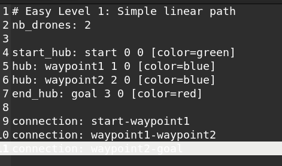
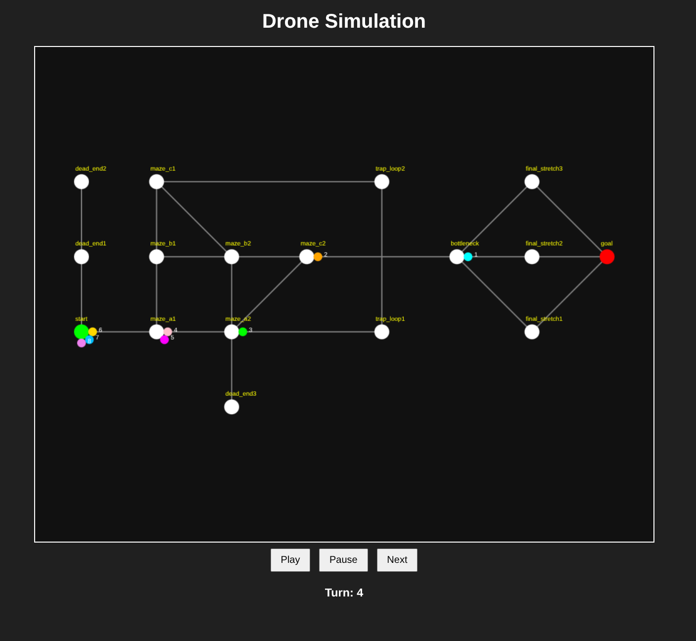

_This project has been created as part of the 42 curriculum by jhenriqu_

# Fly-in - Drones are interesting

**Description**

In this modern world, drones have become fundamental in our society, they are useful in farming, EMS, surveillace and many other areas. This project is centered in identifying the closest path drones must navigate from start to its goal and must be able to navigate it with restrictions set upon them on how many drones can be in certains walkways at the same time and in the least amount of turns.

**Instructions**

This project contains a ``Makefile`` that will compile the program. To compile the program just run command ``make`` in the project's root.

To run the program, execute:
`python3 fly-in.py maps.txt`

or simply run: 

`make` or `make run`.

This will run the program, parse the map information and print the movement of the drones, each line represents one turn (map information and output example can be found in Example Input and expected output). In order to change maps simply compy and past the new map information file "maps.txt" located in the directory.

**Algorithm**

This project uses A* search path finding algorithm. The key idea is that A* doesn't just consider how far it has already travelled—it also estimates how far it still has to go.

For every node, it computes:

f(n)=g(n)+h(n)

where:

g(n) = actual cost from the start to node n
h(n) = estimated remaining cost from n to the goal (heuristic)
f(n) = estimated total cost of a path through n

I also use the Manhattan distance in fuction `def heuristic(hubs, a, b):` to calculate the distance between start and goal:

`|x1 - x2| + |y1 - y2|`

this doesn't guarantee the real path it only estimates what the path's cost.

The cost of each zone are defined based on the metadata provided in the maps file. So with A* in loop `while pq:` it will be removing the lowest cost and adding it to the priority queue that will be organizing the queue by priority.

Then it uses the class `Scheduler` to manage the drone's movements through the path found by A* Algorithm.

**Visual Representation**

For visual representation, I created an script called `htmlexporter.py` that will represent the path and drone's movements 

html visualization(made easier with AI)

**Example Input and Expected Output**

The expected output must contains:
``nb_drones`` = Number of drones 

``start_hub`` = Start Position

``end_hub`` = Drone's goal position

``hub`` = hubs

``connection`` = Connections between the hubs that form the various paths.

The expected output 

`D1-maze_a1 D2-maze_a1`

`D1-maze_a2 D3-maze_a1`

`D1-maze_c2 D2-maze_a2 D4-maze_a1`

`D1-bottleneck D2-maze_c2 D3-maze_a2 D5-maze_a1`

`D1-final_stretch2 D2-bottleneck D3-maze_c2 D4-maze_a2 D6-maze_a1`

`D1-goal D2-final_stretch2 D3-bottleneck D4-maze_c2 D5-maze_a2 D7-maze_a1`

`D2-goal D3-final_stretch2 D4-bottleneck D5-maze_c2 D6-maze_a2 D8-maze_a1`

`D3-goal D4-final_stretch2 D5-bottleneck D6-maze_c2 D7-maze_a2`

`D4-goal D5-final_stretch2 D6-bottleneck D7-maze_c2 D8-maze_a2`

`D5-goal D6-final_stretch2 D7-bottleneck D8-maze_c2`

`D6-goal D7-final_stretch2 D8-bottleneck`

`D7-goal D8-final_stretch2`

`D8-goal`

At the bottom it will also print the total number of turns that it took for all drones to go from `start` to `goal`

`Total ammount of turns: 13`

and it will also generate a message stating that and HTML file with a more detail visual represetation has been generated.

`Created simulation.html`

each line indicating movements in 1 turn

**Resources:**
https://en.wikipedia.org/wiki/Pathfinding - pathfinding algorithm

https://www.youtube.com/watch?v=-L-WgKMFuhE pathfinding algorithm
